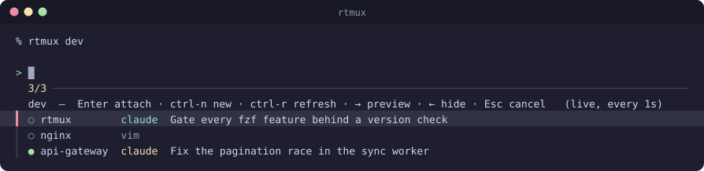
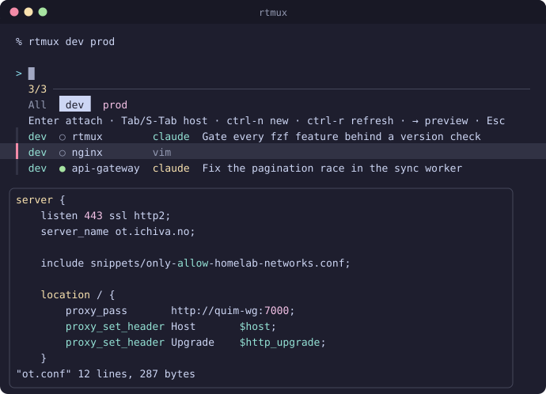
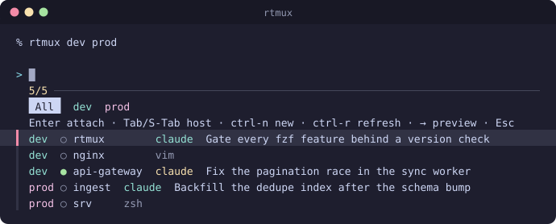

# rtmux — remote tmux session picker

**See every tmux session on your remote hosts and jump into the right one.**
`rtmux` lists the sessions of one or several SSH hosts in an `fzf` picker —
each row enriched remotely with the project directory, the pane's main
process, and (for [Claude Code](https://claude.com/claude-code) sessions) the
conversation's AI-generated title and live status — and attaches to your pick
over a shared SSH connection.

```
rtmux dev                    # pick among dev's tmux sessions and attach
rtmux dev prod               # several remotes → one merged, tabbed picker
rtmux dev:~/code/myapp       # jump to the session rooted in that dir (or start one)
rtmux dev -n api             # start a named session, no picker
rtmux                        # use your configured default host / pool
```

<div align="center">
  
</div>

A session running Claude Code shows up as, e.g.

```
● myapp  claude  Fix the pagination race in the sync worker
```

instead of an anonymous `2` — so you can tell *which* coding session you're
about to rejoin, and whether it's still working, at a glance.

## Requirements

- **Locally:** `zsh`, [`fzf`](https://github.com/junegunn/fzf) (any version
  from 0.27 up — features are version-gated, see *Old fzf* below), `ssh`.
- **Remotely:** `tmux` and `python3`. Nothing to install — the inspector is
  sent inline over the connection. The Claude-title enrichment reads the
  remote Linux `/proc`; without it, rows degrade to the pane's command name.

## Install

Clone it anywhere — `rtmux.zsh` self-locates (and its `.env` defaults to right
next to it), so `~/code` below is just an example:

```sh
git clone https://github.com/deviationist/rtmux.git ~/code/rtmux
echo 'source ~/code/rtmux/rtmux.zsh' >> ~/.zshrc
```

Optionally configure a default host / pool:

```sh
cp ~/code/rtmux/.env.example ~/code/rtmux/.env   # then edit
```

Tab completion registers automatically if `compinit` has run; if you source
rtmux.zsh before `compinit`, registration is deferred to the first prompt, so
`.zshrc` ordering doesn't matter.

## Usage

```
usage: rtmux [-d] [-n] [-a] [-i SECS] [-W] [host[:dir] …] [name]

rtmux <host>          # host = ssh alias or user@host
rtmux <h1> <h2> …     # several remotes → one merged, tabbed picker
rtmux <host>:<dir>    # attach to the session rooted in <dir>, or start one
rtmux -a              # fan out over the whole $RTMUX_HOSTS pool (ignore default)
rtmux -d <host>       # attach with -d (detach any other clients first)
rtmux <host> -n       # skip the picker: start a new session (prompts for a name)
rtmux <host> -n NAME  # …start the named session directly
rtmux -i <secs>       # poll interval (default 1; fractional ok, e.g. 0.5)
rtmux -W <host>       # disable auto-refresh (ctrl-r to refresh manually)
```

**Picker keys:** `↑/↓` navigate · `Enter` attach · `ctrl-n` new session ·
`Tab`/`Shift-Tab` cycle host tabs (multi-host) · `ctrl-r` refresh · `→` live
pane preview · `←` hide it · `Esc` cancel.

### Enriched rows

Each row is built **on the remote side** before it's sent back:

- the **attached** marker (`●` green = attached, `○` dim = detached),
- the **project** — the basename of the active pane's working directory,
  which is what you actually recognize (tmux auto-names sessions `0`/`1`/`2`),
- the active pane's **main process** (`zsh`, `vim`, `htop`, …),
- and for **Claude Code** panes, the conversation's **AI title** plus Claude's
  live **status**, colour-coded on the `claude` tag: **yellow = busy**,
  **cyan = idle** (waiting on you), **dim = dropped to a shell**.

The Claude→session mapping is exact: Claude Code writes a
`~/.claude/sessions/<pid>.json` per live process carrying its `sessionId`,
`cwd`, and `status`; rtmux walks the pane's process tree to the matching
sessions file and reads the title from that exact transcript — no
guessing-by-mtime, even when one directory has several sessions. (Older
Claude builds without the per-pid file fall back to the newest transcript.)

**Row order:** unattached sessions sort to the top — the one you're jumping
into is usually the one you *haven't* attached yet — then by recent activity.

<div align="center">
  
</div>

### Pane preview

`→` opens a live `tmux capture-pane` of the highlighted session's active pane,
so you can confirm it's the one you want before attaching — a build still
scrolling, an editor you left open, the Claude turn in flight. `←` hides it
again.

<div align="center">
  
</div>

### Directory targets (`host:dir`)

When you already know *where* you want to be, name the place:

```
rtmux dev:~/code/myapp       # jump into that project's session
rtmux dev:                   # same, targeting the remote home dir
rtmux dev:~/code/myapp -n    # force a fresh session even if one exists
```

The directory resolves **on the remote** (`~` and relative paths expand
against the remote `$HOME`). One session rooted there → straight attach.
Several → a picker over just those (pane preview up front — pane content is
what tells same-dir sessions apart; `ctrl-n` starts yet another one). None →
rtmux offers (two default-yes prompts) to start one there — named after the
directory — and to launch Claude Code inside it. A missing directory offers
to `mkdir -p` first. In short: an idempotent "take me to this project".

**Tab completion** covers all of it: `rtmux <Tab>` completes hosts (your
`.env` pool plus `~/.ssh/config` aliases, no trailing space so `:` chains),
and `host:<Tab>` completes the **remote directories themselves** over ssh
(BatchMode, 3 s timeout — never password-prompts mid-completion). Hidden
dirs appear once the basename you've typed starts with `.`.

### Multiple remotes

Pass 2+ hosts (or set `RTMUX_HOSTS`) and rtmux queries them all in parallel —
one SSH ControlMaster per host — and merges the sessions into one picker:
every row gets a coloured **host column**, a **tab bar** (`All` / per-host)
cycles with `Tab`/`Shift-Tab`, and preview/attach/`ctrl-n` all target the host
of the row you're on. Unreachable hosts are skipped with a note rather than
sinking the picker.

<div align="center">
  
</div>

Host resolution precedence: explicit args → `--all` pool → `RTMUX_HOST`
(default single) → `RTMUX_HOSTS` pool. So you can keep a fast single-host
default *and* reach the whole fleet on demand.

### New sessions

`ctrl-n` (or `-n`, or being offered when a host has no sessions) starts a
session over the same SSH connection: `Enter` auto-names it, a typed name
creates `tmux new-session -s <name>` — and when the name matches a directory
under `~/code` on the remote (`RTMUX_CODE_DIR` overrides), rtmux offers to
start the session there and to launch Claude Code in it.

### Live refresh

The list re-pulls on a timer (default 1 s) so the attached dot, Claude title
and status stay current while the picker is open. Each poll is one round-trip
over the shared ControlMaster, so it's cheap; the cursor stays pinned to the
same session across refreshes. `-i` tunes it, `-W` (or `RTMUX_WATCH=0`) turns
it off, `ctrl-r` always forces one.

### One connection per host

An SSH **ControlMaster** is opened per host for the run — listing, polls,
previews and the final attach reuse one authenticated channel (at most one
password/2FA prompt), torn down on any exit path including `Ctrl-C`. Startup
runs behind a spinner; the host's login banner is suppressed unless the
connection fails, and `Ctrl-C` during a hung connect cancels immediately.

### Old fzf

`rtmux` reads `fzf --version` once and gates every newer feature, so it runs
on builds as old as **fzf 0.27** (what iSH/Alpine ships): older fzf gets
`toggle-preview`, colon-form `--preview-window`, manual `ctrl-r` refresh
instead of live polling, and no cursor pinning. Thresholds: `load` event
0.36+, `show`/`hide-preview` 0.38+ (also the tabbed multi-host bar), `--id-nth`
0.71+. Running from an iPhone via iSH works — findings in
[`ish-compat.md`](ish-compat.md).

## Configuration

Environment variables (or `.env` next to `rtmux.zsh` — see
[`.env.example`](.env.example)):

| Variable | Default | Meaning |
|---|---|---|
| `RTMUX_HOST` | – | default single remote for a bare `rtmux` |
| `RTMUX_HOSTS` | – | space-separated fan-out pool (`--all`, or bare `rtmux` when no default) |
| `RTMUX_WATCH` | `1` | live refresh on/off |
| `RTMUX_WATCH_INTERVAL` | `1` | seconds between refreshes |
| `RTMUX_CODE_DIR` | `~/code` | remote project root for the `-n` name match |

## Tests

```sh
zsh tests/rtmux.test.zsh
```

The suite stubs `ssh` and `fzf`, so it needs no network, no remote hosts and
no real tmux (tmux-dependent checks skip when it's absent). CI runs it on
every push/PR.

## README images

```sh
zsh tools/generate-readme-svg.zsh          # → assets/*-<hash>.svg + README refs
zsh tools/generate-readme-svg.zsh /tmp/out # fixed names elsewhere, README untouched
```

The images are not drawn — they're rendered from a real run. The generator
stands up two local tmux servers on private sockets, stubs `ssh` so it
dispatches to them instead of a network, and runs rtmux unmodified; the rows,
their colours, the header, the tab bar and the preview pane are its genuine
output. Needs `tmux`, `python3`, `vim` and a C compiler; no network. Commit the
SVGs with the README.

## License

[MIT](LICENSE)
